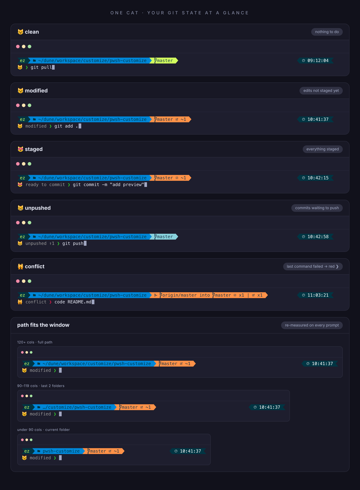

# pwsh-customize 😺

Windows PowerShell을 꾸미는 개인 설정 모음입니다.
[oh-my-posh](https://ohmyposh.dev/) 테마를 바탕으로, 프롬프트의 고양이 표정이 **git 상태에 따라 바뀌고**, 고양이 옆에 **상태 문구**가 함께 표시되도록 만들었습니다.



## 구성

| 파일 | 설명 |
|---|---|
| `Microsoft.PowerShell_profile.ps1` | PowerShell 프로필 (oh-my-posh, Terminal-Icons, PSReadLine 설정, `cc` 단축 명령) |
| `iterm2.omp.json` | oh-my-posh 테마 (`iterm2` 테마 기반 + git 상태 고양이) |
| `install.ps1` | 새 PC에 한 번에 적용하는 설치 스크립트 |

## 설치

```powershell
git clone https://github.com/mhjoon99/pwsh-customize.git
cd pwsh-customize
powershell -ExecutionPolicy Bypass -File .\install.ps1
```

설치 스크립트가 하는 일은 다음과 같습니다.

1. `winget`으로 oh-my-posh를 설치합니다.
2. `Terminal-Icons` 모듈과 Meslo Nerd Font를 설치합니다.
3. 테마 파일을 `~\.config\oh-my-posh\`로 복사합니다.
4. 프로필을 `$PROFILE` 위치로 복사합니다. 기존 프로필은 `.bak`으로 백업됩니다.

설치가 끝나면 **Windows Terminal → 설정 → PowerShell → 모양 → 글꼴**을 `MesloLGM Nerd Font`로 바꾸고 새 창을 여세요.
글꼴을 바꾸지 않으면 아이콘이 □로 깨져 보입니다.

## 고양이 표정과 상태 문구 (git 상태)

프롬프트는 두 줄입니다. 첫 줄에는 사용자·경로·git·시간이, 둘째 줄에는 고양이·상태 문구·`❯`가 표시됩니다.
화면을 반으로 나눠 써도 첫 줄이 더 길어지지 않도록 문구는 비어 있던 둘째 줄에 넣었습니다.

```
 ez   ~/dune/workspace/customize/pwsh-customize   master  ~1        15:05:20
😼 modified ❯ git add .
```

상태가 여러 개 겹치면 위에 있는 것이 먼저 표시됩니다.

| 고양이 | 상태 문구 | 상황 |
|:---:|---|---|
| 🙀 | `conflict` | 머지 충돌 (unmerged 파일 있음) |
| 🙀 | `rebasing` · `merging` · `cherry-picking` · `reverting` | 해당 작업이 진행 중 |
| 😾 | `diverged ↑1 ↓2` | 원격과 갈라짐 (ahead + behind 둘 다) |
| 😿 | `behind ↓2` | 원격보다 뒤처짐 (pull 필요) |
| 😹 | `partially staged` | 스테이징된 것과 안 된 변경이 섞여 있음 |
| 😻 | `ready to commit` | 스테이징 완료 |
| 😼 | `modified` | 스테이징 전 변경 있음 (untracked 포함) |
| 😸 | `unpushed ↑3` | 깨끗한데 push 안 한 커밋이 있음 |
| 😽 | `stashed 1` | 깨끗한데 stash가 남아 있음 |
| 😺 | (없음) | 완전히 깨끗함 |
| 🐱 | (없음) | git 저장소가 아닌 폴더 |

- `↑`/`↓` 뒤의 숫자는 원격보다 앞선/뒤처진 커밋 수입니다.
- 평소 상태(😺, 🐱)에서는 문구를 생략하므로, 문구가 보이면 확인할 일이 있다는 뜻입니다.
- 문구는 고양이가 눈에 잘 띄도록 회색으로 흐리게 표시됩니다.
- 문구와 입력한 명령을 구분하기 위해 끝에 `❯`를 붙였습니다. 직전 명령이 성공하면 초록, 실패하면 빨강으로 표시됩니다.
- 이미 실행한 명령의 프롬프트는 `🐱 ❯`만 남기고 접힙니다 (transient prompt).

## 창 너비에 따른 경로 표시

창이 좁아도 첫 줄이 두 줄로 넘어가지 않도록, 프롬프트가 표시될 때마다 창 너비에 맞춰 경로를 줄여서 보여줍니다.

| 창 너비 (글자 수) | 경로 표시 | 예시 |
|---|---|---|
| 120 이상 | 전체 경로 | `~/dune/workspace/customize/pwsh-customize` |
| 90 ~ 119 | 마지막 폴더 2단계 | `…/customize/pwsh-customize` |
| 90 미만 | 현재 폴더만 | `pwsh-customize` |

- 그래도 첫 줄이 넘치면 오른쪽 블록(배터리·시간)을 숨깁니다.
- 기준 너비는 `iterm2.omp.json`의 path 세그먼트에 있는 `min_width`/`max_width` 값으로 바꿀 수 있습니다.

## `cc` 단축 명령

```powershell
cc            # = claude --dangerously-skip-permissions
cc -c         # 뒤에 붙인 옵션도 그대로 전달됩니다
```

> ⚠️ **주의**: `--dangerously-skip-permissions`는 Claude Code가 파일 수정이나 명령 실행을 **묻지 않고 바로 실행**하게 하는 옵션입니다.
> 이 동작이 부담스럽다면 프로필에서 `cc` 함수를 지우거나 `claude`로 바꿔 쓰세요.

## 설정 업데이트

설정 파일을 수정했다면 이 저장소에 반영해서 push하고, 다른 PC에서는 `git pull` 후 `install.ps1`을 다시 실행하면 됩니다.

## 문제 해결

- **고양이 대신 템플릿 오류가 보일 때**: oh-my-posh 버전이 오래된 것일 수 있습니다. `oh-my-posh upgrade`를 실행하세요.
- **설정을 바꿨는데 반영이 안 될 때**: `oh-my-posh cache clear`를 실행한 뒤 새 창을 여세요.
- **"스크립트를 실행할 수 없습니다" 오류가 날 때**: `Set-ExecutionPolicy -Scope CurrentUser RemoteSigned`를 실행하세요.

## Credits

- [oh-my-posh](https://github.com/JanDeDobbeleer/oh-my-posh) (MIT License): 테마는 기본 제공 `iterm2` 테마를 수정했습니다.
- [Terminal-Icons](https://github.com/devblackops/Terminal-Icons)
